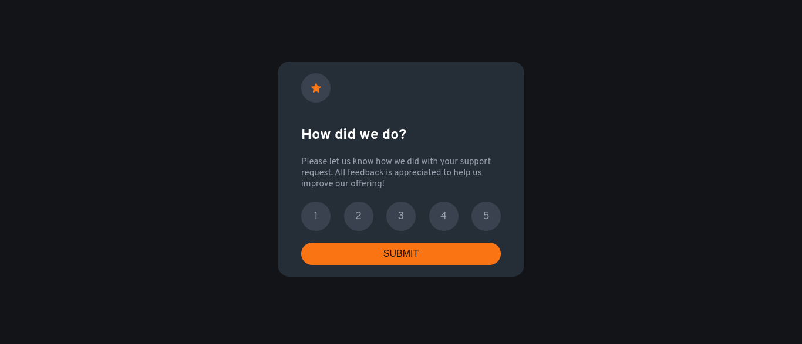

# Frontend Mentor - Interactive rating component solution

This is a solution to the [Interactive rating component challenge on Frontend Mentor](https://www.frontendmentor.io/challenges/interactive-rating-component-koxpeBUmI). Frontend Mentor challenges help you improve your coding skills by building realistic projects.

## Table of contents

- [Overview](#overview)
  - [The challenge](#the-challenge)
  - [Screenshot](#screenshot)
  - [Links](#links)
- [My process](#my-process)
  - [Built with](#built-with)
  - [What I learned](#what-i-learned)
  - [Continued development](#continued-development)
  - [Useful resources](#useful-resources)
- [Author](#author)

## Overview

this is my solution for the `front end mentor challenge interactive rating component` and I used the simplest solution using `HTML5`, `CSS3`, and `JS` without any frameworks or libraries.

### The challenge

Users should be able to:

- View the optimal layout for the app depending on their device's screen size
- See hover states for all interactive elements on the page
- Select and submit a number rating
- See the "Thank you" card state after submitting a rating

### Screenshot



### Links

- Solution URL: [frontendmentor solution](https://your-solution-url.com)
- Live Site URL: [github pages](https://your-live-site-url.com)

## My process

### Built with

- Semantic HTML5 markup
- CSS custom properties
- Responsive Layout
- Flexbox
- JS

### What I learned

Most of my solution was created with HTML5, CSS3, and pure JS DOM and Adding accessibility and Semantic these are what I focus on.

```html
<div aria-describedby="rating-description" class="rating-list">
  <div class="rating" data-rating="1">1</div>
  <div class="rating" data-rating="2">2</div>
  <div class="rating" data-rating="3">3</div>
  <div class="rating" data-rating="4">4</div>
  <div class="rating" data-rating="5">5</div>
</div>
```

```css
@layer base,components,utilities;
:root {
  /* mobile size  */
  --MOB-SIZE: 376px;
  /* colors */
  --Orange: hsl(25, 97%, 53%);
  --White: hsl(0, 0%, 100%);

  --Light-Grey: hsl(217, 12%, 63%);
  --Light-Dark-Blue: hsl(217deg 14.57% 26.93%);
  --Dark-Blue: hsl(213, 19%, 18%);
  --Very-Dark-Blue: hsl(216, 12%, 8%);
  /* font family and font base size */
  --FONT: "Overpass", sans-serif;
  --P-FONT-SIZE: 15px;
}

@layer base {
  *,
  *::before,
  *::after {
    padding: 0;
    margin: 0;
    box-sizing: border-box;
  }
  html {
    font-size: 62.5%;
  }
  body {
    font-family: var(--FONT);
    background-color: var(--Very-Dark-Blue);
    display: flex;
    flex-direction: column;
    justify-content: center;
    align-items: center;
    min-height: 100vh;
    padding: 0 2rem 1rem;
  }
  p {
    font-size: var(--P-FONT-SIZE);
    color: var(--Light-Grey);
    &.thanks-text {
      line-height: 1.5;
    }
  }
  h1 {
    font-size: 2.5rem;
    font-weight: 700;
    color: var(--White);
  }
}
```

```js
ratingList.forEach((rating) => {
  rating.addEventListener("click", function (e) {
    if (this.dataset.rating === e.target.textContent) {
      ratingList.forEach((rating) => rating.classList.remove("active"));
      this.classList.add("active");
      selectedRating = this.innerText;
    }
  });
});
```

### Continued development

I focus on writing Accessible and semantic HTML5 markup.

### Useful resources

https://design102.blog.gov.uk/2022/01/14/whats-the-alternative-how-to-write-good-alt-text/

- [MDN-a good basis of accessibility](https://developer.mozilla.org/en-US/docs/Learn/Accessibility/HTML) - This helped me for add more accessible attributes. I really liked this pattern and will use it going forward.
- [Design102-What’s the alternative? How to write good alt text](https://design102.blog.gov.uk/2022/01/14/whats-the-alternative-how-to-write-good-alt-text) - This is an amazing article which helped me understand how to write good alt text. I'd recommend it to anyone still learning this concept.

## Author

- Website - [my portfolio](https://abdelmonaem-portfolio.vercel.app/)
- Frontend Mentor - [@coder-abdo](https://www.frontendmentor.io/profile/coder-abod)
